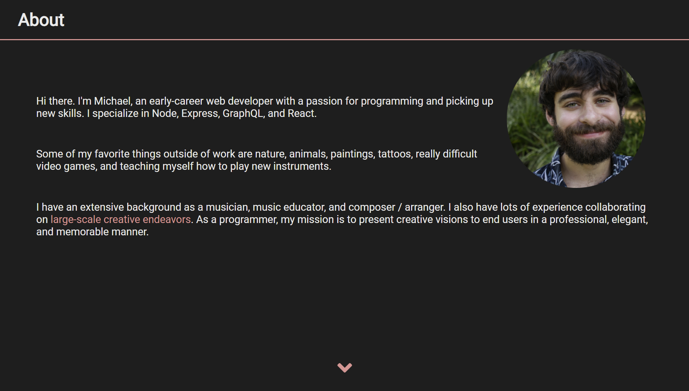

# Portfolio

This fully responsive site was from scratch without the use of any libraries or frameworks. I used this simple project as an opportunity to practice my CSS skills. Features include:

- ability to toggle theme
- icons
- animated drop-down mobile nav
- psuedo selectors
- css grid and flexbox
- relative, fixed, and absolute positioning of elements
- simple transition animations
- media queries
- minimalist design

Deployed site is viewable <a href="https://michael-rodriguez22.github.io/portfolio/">here</a>. Enjoy!

